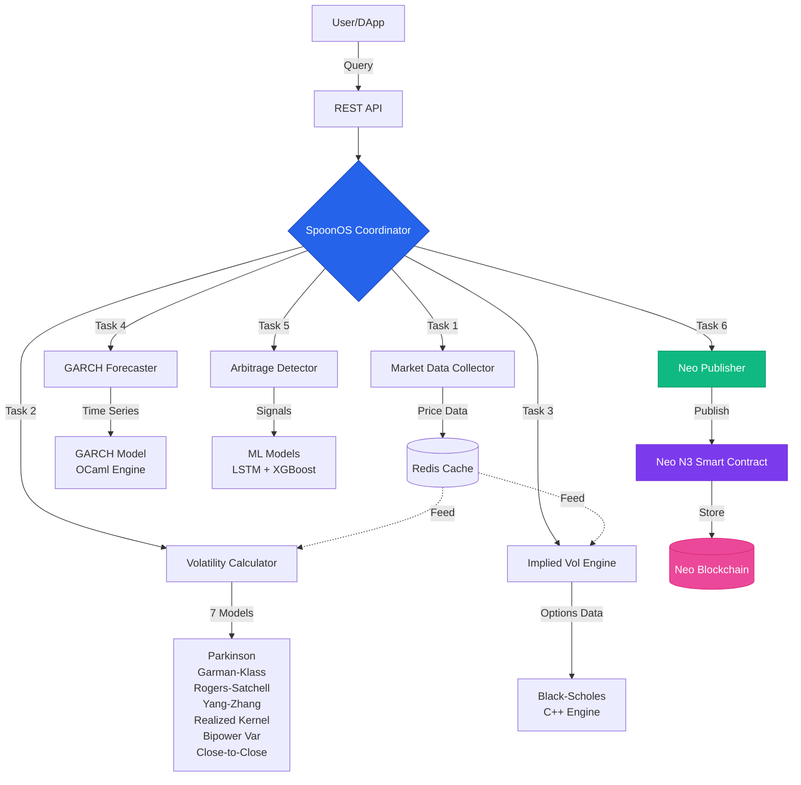
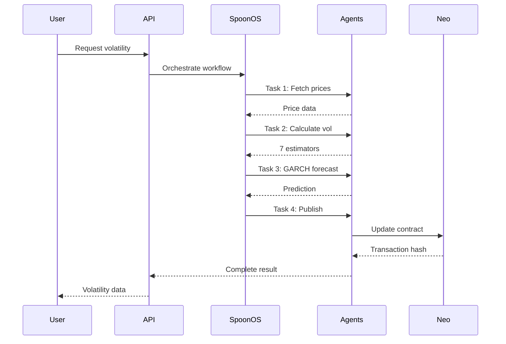
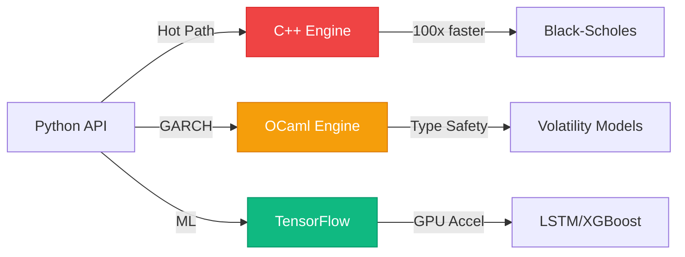

# AgentSpoons Architecture

## Data Flow

## Component Details

### SpoonOS Agents

| Agent | Responsibility | Dependencies | Output |
|-------|----------------|--------------|--------|
| Market Data Collector | Fetch OHLCV from DEXs | None | Price feeds |
| Volatility Calculator | Compute 7 estimators | Market Data | RV estimates |
| Implied Vol Engine | Build vol surface | Market Data | IV surface |
| GARCH Forecaster | Time series prediction | Volatility Calc | Forecast |
| Arbitrage Detector | Find IV-RV spread | Vol Calc plus IV | Signals |
| Neo Publisher | Write to blockchain | All agents | Tx hash |

### Performance Optimizations

